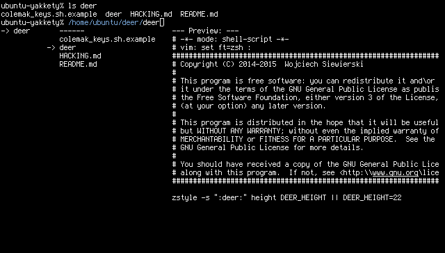
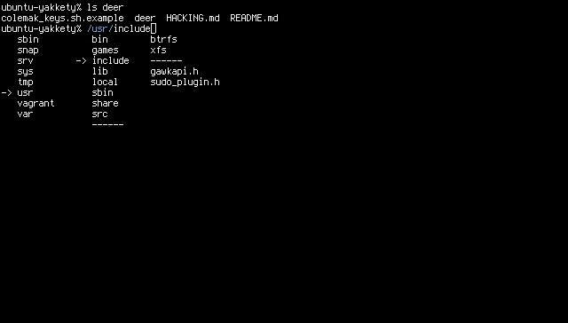

deer
====

[](https://gitter.im/Vifon/deer?utm_source=badge&utm_medium=badge&utm_campaign=pr-badge&utm_content=badge)

DESCRIPTION
-----------

`deer` is a file navigator for [zsh](http://zsh.sourceforge.net/)
heavily inspired by [ranger](http://ranger.nongnu.org/).

**WHY**

I've created `deer` because I really like to use `ranger` as an
extension of my shell to quickly navigate the
directories. Unfortunately, its startup time (even though short) is
sometimes cumbersome. `deer` implements the very basic ranger-like
file navigation + some basic operations on the commandline, like
inserting the selected path (in various ways), which makes it fast to
launch and ideal for the task. Not using the whole terminal can be
viewed as an another feature.

Pros:  
* Launches much faster.
* Better shell integration.
* Retains the terminal contents and only uses a small part of the terminal.

Cons:  
* Offers only a small subset of `ranger's` features.
* Needs `zsh`.

[](screenshots/2017-08-03-215440_640x364_scrot.png)
[](screenshots/2017-08-03-215509_640x364_scrot.png)

USAGE
-----

To launch `deer`, press `alt+k`.

You can supply a numeric argument (`alt-number`) to go up the
appropriate number of directory levels upon start.

If you activate `deer` with the cursor on a path, it will start in there.

**KEYS AND FUNCTIONS**

These functions can be bound custom keys (the default is in the
parentheses):

* `down` (<kbd>j</kbd>) -- One item down.
* `page_down` (<kbd>J</kbd>) -- Five items down.
* `up` (<kbd>k</kbd>) -- One item up.
* `page_up` (<kbd>K</kbd>) -- Five items up.
* `enter` (<kbd>l</kbd>) -- Enter the selected directory.
* `leave` (<kbd>h</kbd>) -- Leave the current directory (one directory up).
* `next_parent` (<kbd>]</kbd>) -- One item down in the left column.
* `prev_parent` (<kbd>[</kbd>) -- One item up in the left column.
* `search` (<kbd>/</kbd>) -- Select the first file matching the given pattern.
* `filter` (<kbd>f</kbd>) -- Shows only files matching the given pattern.
* `toggle_hidden` (<kbd>H</kbd>) -- Show/hide the hidden files.
* `quit` (<kbd>q</kbd>) -- Exit `deer`.
* `append_path` (<kbd>a</kbd>) -- Insert the current path and leave the cursor on its right.
* `append_abs_path` (<kbd>A</kbd>) -- Absolute path version.
* `insert_path` (<kbd>i</kbd>) -- Insert the current path and leave the cursor on its left.
* `insert_abs_path` (<kbd>I</kbd>) -- Absolute path version.
* `multi_insert_dwim` (<kbd>s</kbd>) -- Insert the current path, add a smart separator using the last character before the cursor (unless it's an opening brace, then use a comma), move the cursor down and don't quit yet.
* `multi_insert_abs` (<kbd>S</kbd>) -- Insert the current absolute path and don't quit yet.
* `chdir` (<kbd>c</kbd>) -- `cd` into the current directory and quit.
* `chdir_selected` (<kbd>C</kbd>) -- `cd` into the selected directory and quit.
* `rifle` (<kbd>r</kbd>) -- Run `rifle(1)` on the selected file.

To bind a function to a different key, add something like this to your
`.zshrc`:

```
typeset -Ag DEER_KEYS
DEER_KEYS[function]=key
```

The `DEER_KEYS` variable is an associative array holding the keys
associated with functions. One function may be bound to only one key
(meaning the previous one is overwritten).

INSTALLATION
------------

**First method**

I assume you have `~/.fpath` added to your `$FPATH` variable here. If
you don't, either add it or use the second installation method. If you
use some other directory, modify the commands below accordingly.

Copy the `deer` main file to `~/.fpath/deer` and make sure it gets
autoloaded in your `zshrc`:

```
autoload -U deer
```

Adding these lines will make the script available to the line editor, and bind
it to `alt+k` respectively:

```
zle -N deer
bindkey '\ek' deer
```

**Second method**

Alternatively, you can directly source the file `deer`, and bind the
initialization function to `alt+k` as follows:

```
source /path/to/deer.sh
zle -N deer
bindkey '\ek' deer
```

**Third method**

With a plugin manager. Tested with
[antigen](https://github.com/zsh-users/antigen),
[zgen](https://github.com/tarjoilija/zgen) and
[zplug](https://github.com/zplug/zplug):

- antigen:

```
antigen bundle Vifon/deer
antigen apply
autoload -U deer
zle -N deer
bindkey '\ek' deer
```

- zgen:

```
zgen load Vifon/deer
zgen save
autoload -U deer
zle -N deer
bindkey '\ek' deer
```

- zplug:

```
zplug "vifon/deer", use:deer
zle -N deer
bindkey '\ek' deer
```

CONFIGURATION
-------------

By default, `deer` will use 22 lines of your terminal. This is configurable
with the `zstyle` mechanism. Drop a line like this in `zshrc` to adjust this
setting:

```
zstyle ':deer:' height 35
```

To customize the keys used by `deer`, you may use the following code:

```
typeset -Ag DEER_KEYS   # Prepare the associative table.
DEER_KEYS[action_name]=key
```

Users of the Colemak keyboard layout may use the included
`colemak_keys.sh.example` file to adjust the default keys to Colemak:

```
source colemak_keys.sh.example.
```

KNOWN ISSUES
------------

_These are the issues that I'm aware of, along with the reason for why
I've decided not to fix them for now. If you think any of them is a
dealbreaker, open a ticket on Github and I'll see what I can do._

**Slashes are replaced with division slashes (U+2215) in file previews**

This is an ugly workaround, and the issue is with the way the output is
formatted (slash is used as a separator for `paste(1)` and
`column(1)` as it cannot appear in the filename).

**The ../ directory is not correctly shown when completing the
  previously typed path**

The shown path is created by deleting the preexisting prefix from the
absolute path. It greatly simplifies the code and makes it easier to
maintain (it's already quite messy in some places).

**Buggy behavior in the root directory (/)**

The root directory handling is quite tricky as it's the only directory
where going up and down does not keep you in the same directory. I've
concluded that that directory itself is used very rarely and most of
the bugs are not fatal.

FAQ
---

**Can you add colors?**

Unfortunately, no. It's a limitation of the underlying `zle` (zsh
line editor) and I cannot do much about it.

**Why are there so many strange features and their variations?**

At first I add new features taylored for myself. Later I plan to
review these features and clean them up. If you need something else,
please leave a feature request or add it yourself if you know how.

**The key binding system is ugly**

Yes, it is. I plan to replace it with a proper keymap but for now it
should suffice.

RELATED PROJECTS
----------------

[lscd](https://github.com/hut/lscd) from the author of the original
ranger is a minimal file browser written in a POSIX shell (with only a
few necessary bashisms).

[blscd](https://github.com/D630/blscd) is a Bash fork of `lscd` which
is very similar to ranger.

SEE ALSO
--------

ranger(1), zsh(1)

AUTHOR
------

Wojciech 'vifon' Siewierski < wojciech dot siewierski at gmail dot com >

COPYRIGHT
---------

Copyright (C) 2014-2015  Wojciech Siewierski

This program is free software: you can redistribute it and/or modify
it under the terms of the GNU General Public License as published by
the Free Software Foundation, either version 3 of the License, or
(at your option) any later version.

This program is distributed in the hope that it will be useful,
but WITHOUT ANY WARRANTY; without even the implied warranty of
MERCHANTABILITY or FITNESS FOR A PARTICULAR PURPOSE.  See the
GNU General Public License for more details.

You should have received a copy of the GNU General Public License
along with this program.  If not, see <http://www.gnu.org/licenses/>.
